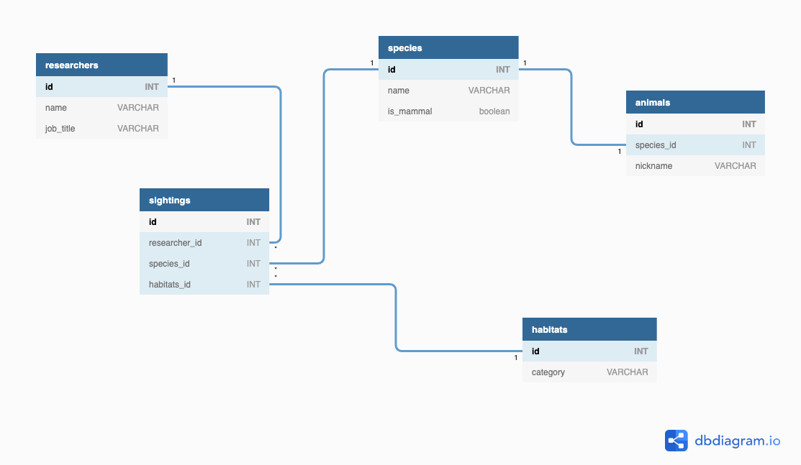

# Pursuit-Core-Web-Unit-3-Assessment

## Introduction

A marine biology research team needs our help! Their old database wasn't doing a great job at organizing their research data. They do a lot of work in the field, and they keep track of all of it- they log every sighting of an animal species, and they make sure to keep track of which habitats are home to which species.

Therefore, we are going to create a database for them with the following tables:

- **Researchers**: Rows represent each individual member of the research team.
- **Species**: Rows represent each different type of animal species (e.g. dolphin or sting ray).
- **Animals**: Rows represent each animal researchers have found and tagged.
- **Habitats**: Rows represent different types of habitats in the researchers' area (e.g. reef, beach, shallows, deeps).
- **Sightings**: Rows represent each time a researcher saw a specific species in a particular habitat.

Based on these descriptions, we can conclude:

- Researchers have many Sightings (they see species).
- Species have many Animals (animals have species), and many Sightings (different species are seen in different environments).
- Animals have one Species (a dolphin is a dolphin).
- Sightings have one Researcher, one Species, and one Habitat (a particular researcher sees a species in a habitat - this is a join table).
- Habitats have many sightings (many sightings happen in a specific habitat).

Take a look at `schema.md` in this repo for a detailed description of what the tables should look like, as well as seed data describing what they should contain.

Once we create our database, we need to provide the research team with a robust RESTful API to make it easy for them to see and update information. Take a look at `routes.md` for a full list of the routes this API should have. Please make sure to link it up with your Postgres database!

The format for all responses should be a JSON object with up to three keys:

- `status` - Either `success` or `error`
- `message` - Either `got all users` or an error message
- `body` - Your response from SQL (if necessary - not necessary for POST or DELETE requests).

## Database Schema

### Tables and Columns

- **Researchers**
  - `id`: Integer, primary key.
  - `name`: String.
  - `job_title`: String.
- **Species**
  - `id`: Integer, primary key.
  - `name`: String.
  - `is_mammal`: Boolean.
- **Animals**
  - `id`: Integer, primary key.
  - `species_id`: Integer, foreign key referencing `id` column in Species table.
  - `nickname`: String.
- **Habitats**
  - `id`: Integer, primary key.
  - `category`: String.
- **Sightings**
  - `id`: Integer, primary key.
  - `researcher_id`: Integer, foreign key referencing `id` column in Researchers table. Add "ON DELETE SET NULL".
  - `species_id`: Integer, foreign key referencing `id` column in Species table. Add "ON DELETE CASCADE".
  - `habitat_id`: Integer, foreign key referencing `id` column in Habitats table.

### Diagram

### Seed Data

- **Researchers**
  - Mariana Aleta, Job Title: Project Lead.
  - Javed Patrick, Job Title: Senior Field Researcher.
  - Carolina Itai, Job Title: Field Researcher.
  - Jazmyn Gottfried, Job Title: Field Researcher.
  - Ezra Flip, Job Title: Research Intern.
- **Species**
  - Dolphin, Mammal: `true`.
  - Moray Eel, Mammal: `false`.
  - Tiger Shark, Mammal: `false`.
  - Orca Whale, Mammal: `true`.
  - Moon Jelly, Mammal: `false`.
- **Animals**
  - Two Dolphins, Nicknames: "Flip" and "Skip".
  - One Moray Eel, Nickname: "Jenkins".
  - One Tiger Shark, Nickname: "Sally".
  - Three Moon Jellies, Nicknames: "Flapjack", "Gibbous", and "Nox"
- **Habitats**
  - Category: Shallows.
  - Category: Coral Reef.
  - Category: Tide Pools.
  - Category: Deeps.
- **Sightings**
  - An Orca Whale was spotted by Jazmyn Gottfried in the Deeps.
  - A Tiger Shark was spotted by Mariana Aleta in the Deeps.
  - A Moon Jelly was spotted by Carolina Itai in the Tide Pools.
  - A Moray Eel was spotted by Ezra Flip in the Coral Reef.
  - A Dolphin was spotted by Javed Patrick in the Shallows.
  - A Moray Eel was spotted by Ezra Flip in the Shallows.
  
  
## Backend/API Routes

- **Researchers**
  - GET `/researchers`: Get all researchers.
  - GET `/researchers/:id`: Get single researcher.
  - POST `/researchers`: Add new researcher.
  - PATCH `/researchers/:id`: Update single researcher.
  - DELETE `/researchers/:id`: Delete single researcher.
- **Species**
  - GET `/species`: Get all species.
  - GET `/species/:id`: Get single species.
  - POST `/species`: Add new species.
- **Animals**
  - GET `/animals`: Get all animals.
  - GET `/animals/:id`: Get single animal.
  - POST `/animals`: Add new animal.
  - PATCH `/animals/:id`: Update single animal.
  - DELETE `/animals/:id`: Delete single animal.
- **Habitats**
  - GET `/habitats`: Get all habitats.
  - GET `/habitats/:id`: Get single habitat.
  - POST `/habitats`: Add new habitat.
- **Sightings**
  - GET `/sightings`: Get all sightings.
  - GET `/sightings/species/:id`: Get all sightings of a specific species.
  - GET `/sightings/researchers/:id`: Get all sightings for a specific researcher.
  - GET `/sightings/habitats/:id`: Get all sightings for a specific habitat.
  - POST `/sightings`: Add new sighting.
  - DELETE `/sightings/:id`: Delete single sighting.

## Front End

Connect to your server, and have a website with the following functionality:

- Show all sightings
- Show all sightings from a given researcher

## Rubric

